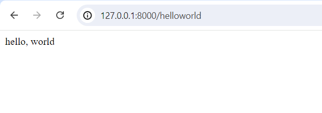

1. Route
 
1.1 cú pháp đơn giản 
 

Route::{method}('{url}',{function or ['{controllername}::class','{method name}']})
 
Ví dụ 1:  Route::get('/helloworld', function(){  
    return 'hello, world';  
}) 

 
 
Ví dụ 2: Route::get('/1.2',[TestController::class,'index']);  
 
